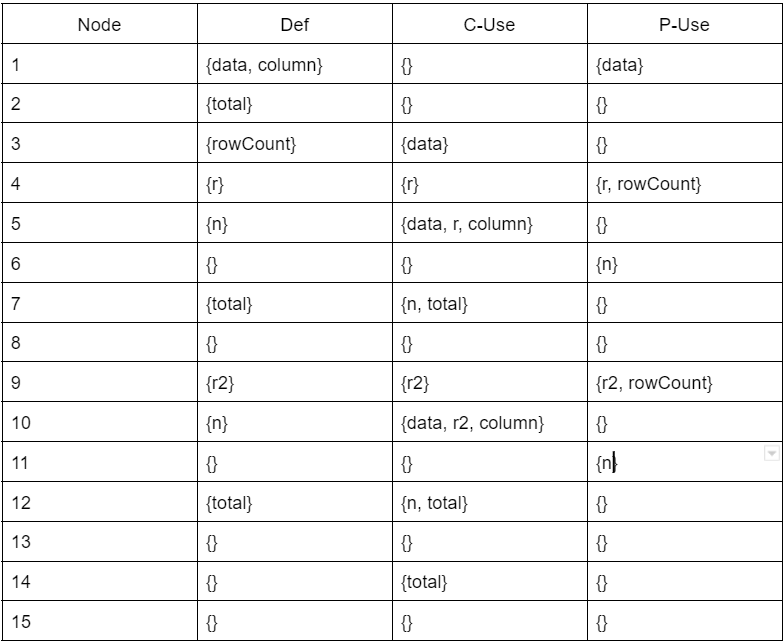
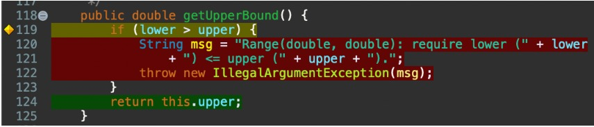
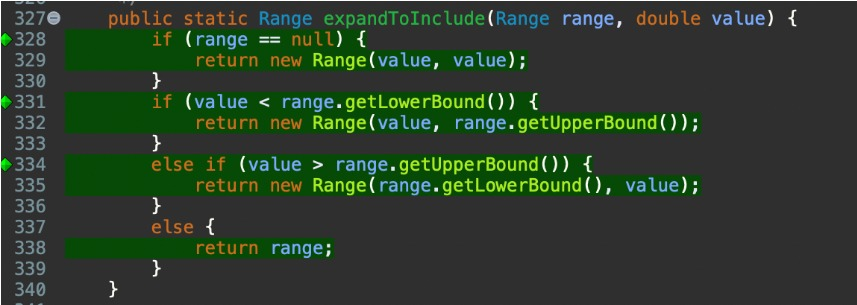

**SENG 438 - Software Testing, Reliability, and Quality**

**Lab. Report #3 – Code Coverage, Adequacy Criteria and Test Case Correlation**

| Group \#:      |
| -------------- |
| Student Names: |
| Aleksander Rudolf                |
| Anshdeep Singh              |   
| Jannine Osman               |   
| Jaskaran Bhatia                |   

(Note that some labs require individual reports while others require one report
for each group. Please see each lab document for details.)

# 1 Introduction

In this lab, we explored white-box testing, specifically coverage-based testing, and explored coverage tools to explore branch, line and method coverage. We used EclEmma, an extension built-in to Eclipse that is a coverage tool. This tool allowed us to explore the coverage of our test suite from assignment 2 and allowed us to improve upon that test suite to obtain acceptable coverage for the following categories: 90% for statement coverage, 70% for branch coverage, and 60% for conditional coverage. We also got familiar with measuring the data flow coverage manually and drawing data flow graphs. 

# 2 Manual data-flow coverage calculations for DataUtilities.calculateColumnTotal(Values2D data, int column) and Range.contains(double value) methods

## DataUtilities.calculateColumnTotal(Values2D data, int column)

### Data Flow Graph

### Def-Use Sets per Statement

### DU-Pairs per Variable

### DU-Pairs Covered per Test

## Range.contains(double value)

### Data Flow Graph

### Def-Use Sets per Statement

### DU-Pairs per Variable

### DU-Pairs Covered per Test

# 3 A detailed description of the testing strategy for the new unit test

Our testing plan was very similar to that of assignment two except this time we had access to the code. Our plan was to determine the original coverage and determine what methods we could improve upon. For the more complex methods, we worked together to determine test cases that would allow for full coverage. Initially, we looked at the original code coverage, and we were able to see lines and conditional statements that we missing in our original test suite. After examining what lines and branches were missed for each method, we each picked certain methods to work on individually to increase the coverage. If a branch was missed in our original test case then we would write a test case to specifically target that branch. After all of us completed our assigned test cases for our methods and improved upon the original coverage we combined the test code to see the overall coverage. We continued this cycle until we reached the total necessary coverage across the class.  We made sure to design our test cases in a way that allowed for all branches and lines in a method to be covered. Being able to see the code also allowed us to find boundary cases we may have missed initially, and we designed test cases for the missed boundary cases accordingly. We had some difficulties as there were a few private methods in the Range class. We were able to test these private methods indirectly, as the private methods were used in another public class we wrote test cases. Eventually, after writing test cases for the public classes that used the private classes we obtained full coverage for the private classes. 

# 4 A high level description of five selected test cases you have designed using coverage information, and how they have increased code coverage

## Range.intersects - smallerRangeIntersects()

smallerRangeIntersects is a test case that we designed to test the method Range. intersect(double b0, double b1). This test case works to cover the first branch in the range method. The smallerRangeIntersects test provides b0 = -20 and b1 = -11 and the range was (-10,10) to test the first conditional statement in the Range.intersect(double b0, double b1) method. Below is a screenshot of the Range.intersect(double b0, double b1) is shown:

The first conditional statement is if(b0 <= this.lower) and b0 = -20 is less than -10 so the code will go through this conditional statement. Inside the conditional statement b1 = -11 < this.lower = 10, so the method should return false as there’s no intersection for the test range and actual range. We designed this test case to ensure we obtained coverage inside the if statement. We did not have test cases in our assignment 2 test suite for the Range.intersects(double b0, double b1) method so our coverage went from 0% to 100% line coverage which helped us get to the overall line coverage goal of 90%. This test case also obtains 87.5% branch overage and 100% method coverage. 

## Range.combine - combineOneNullAndOneNonNullRange2()

The test case combineOneNullandOneNonNullRange2 works to test the Range.combine(Range range1, Range range2) method. This method creates a new range by combining the two existing ranges. If one range is null it will return the other range. When both ranges are null it will return null, and if both ranges are non-null it will return the combination of the 2 ranges. The test case combineOneNullAndOneNonNullRange2 works to reach the second conditional statement of the method. 

The first range provided in this test case is (-10, 10) and the second range provided in the test case is null. The test case passes so we know the second conditional statement is covered and that it is functional. We also designed test cases to reach the first conditional statement in this and to reach the bottom statements of the method. This test case helped us obtain better branch and line coverage. We also did not test this method in our assignment two labs so by simply having test cases for this method our overall test coverage for the class was increased.

## Range.combineIgnoringNaN - combineIgnoringNaNBothNullRanges()

There were no test cases that tested the functionality of this method. By the addition of this method, we increase the coverage by a decent proportion. For this particular method, the line coverage is 92.3%, the branch coverage is about 93% and the method coverage is 100%.  

The reason why the method coverage we got is 100% is that all the test cases under this method were successfully validated and entered during execution.

## DataUtilities.calculateRowTotal - calculateRowTotalDataWithIntArray()

The test cases for the method getColumnRowTotal were not tested in any test cases before which resulted in no coverage for this method. Now that the test case for the method has been added, there is an increase in method coverage to 100% because of the addition of the method and its test cases, For the line coverage, it has increased to 91.7% because the test case described above is covering the lines where it can be found which is from lines 217 to 232. Now when we talk about the branch coverage, for the method particularly, the method does not cover the if statement on line 220, also it does not cover the else case on line 227 where n!=null and that is why the branch coverage is 62.5%.

## DataUtilities.calculateColumnTotal - calculateColumnTotalDataWithIntArray()

The test cases for the method getColumnRowTotal were not tested in any test cases before which resulted in no coverage for this method. Now that the test case for the method has been added, there is an increase in method coverage to 100% because of the addition of the method and its test cases, For the line coverage, it has increased to 91.7% because the test case described above is covering the lines where it can be found which is from lines 217 to 232. Now when we talk about the branch coverage, for the method particularly, the method does not cover the if statement on line 158 which is total>0, also it does not cover the else case on line 167  where n!=null and that is why the branch coverage is 62.5%.

# 5 A detailed report of the coverage achieved of each class and method (a screen shot from the code cover results in green and red color would suffice)

## Initial Coverage of the Test Suite of Lab 2

Our team used EclEmma to measure the adequacy of our test suite. EclEmma allows us to view the line coverage, branch coverage and method coverage. EclEmma is already built into Eclipse which allows for easy use. For the Range class, we tested methods contains, getLength, getLowerBound, getUpperBound, and getCentralValue. For the DataUtilities class, we tested methods calculateColumnTotal, calculateRowTotal, getCumulativePercentages, createNumberArray, and createNumberArray2D. The results from the EclEmma coverage tool were as follows:

### Range Test Coverage

Line: 14.3%
Branch: 12.2%
Method: 26.1%

### DataUtilities Test Coverage

Line: 12.5%
Branch: 6.2%
Method: 30.0%

## Coverage of the Test Suite of Lab 3

### Range Class

We first started off by working on developing better test cases for the Range class. We divided the remaining methods between the 4 of us and continuously combined our new test cases on one person’s laptop to see how our coverage has changed. Eventually, we were able to obtain the necessary results for acceptable testing coverage. 

Line: 91.6%

Branch: 90.2%

Method: 100%

#### Range(double lower, double upper)

#### getLowerBound()

#### getUpperBound()

#### getLength()

#### getCentralValue()

#### intersects(double b0, double b1)

#### intersects(Range range)

#### constrain(double value)

#### combine(Range range1, Range range2)

#### contains(double value)

#### combineIgnoringNaN(Range range1, Range range2)

#### min(double d1, double d2)

#### expandToInclude(Range range, double value)

#### expand(Range range, double lowerMargin, double upperMargin)

#### shift(Range base, double delta)

#### shift(Range base, double delta, boolean allowZeroCrossing)

#### shiftWithNoZeroCrossing(double value, double delta)

#### scale(Range base, double factor)

#### equals(Object obj)

#### isNaNRange()

#### hashCode()

#### toString()

### DataUtilities Class

The data utilities had much fewer methods to work with in improving the test coverage. This made it much more difficult as we had to improve our previous tests and create new test cases for the old methods to increase the overall coverage. We also had some difficulties as initially our tests using a mock object were showing no coverage. After some troubleshooting we were able to obtain the following improved coverage:

Line: 90.4%

Branch: 84.4%

Method: 100%

#### equal(double[][] a, double[][] b)

#### clone(double[][] source)

#### calculateColumnTotal(Values2D data, int column)

#### calculateColumnTotal(Values2D data, int column, int[] validRows)

#### calculateRowTotal(Values2D data, int row)

#### calculateRowTotal(Values2D data, int row, int[] validCols)

#### createNumberArray(double[] data)

#### createNumberArray2D(double[][] data)

#### getCumulativePercentages(KeyedValues data)

# 6 Pros and Cons of coverage tools used and Metrics you report

We tried to use clover at the beginning,  however, certain features of clover are not free, and licenses must be purchased in order to use it. Setting up and configuring Clover was turning out to be bit complex, especially for us as we were not familiar with code coverage tools. We decided to shift to ElcEmma thereafter.

The benefit of using ElcEmma is that it is already built into Eclipse making it easy to use. We also did not have to go through further installation processes to use the tool. The ElcEmma also allows for easy visualization of multiple categories such as branch counters, line counters and method counters. One downfall of ElcEmma is that the coverage percentages can be difficult to interpret. Initially, we were unsure if we should be looking at the DataUtilitiesTest class coverage percentages or if we should be looking at the percentages of the DataUtilities class. We also thought the ElcEmma only showed values for branch coverage, but upon experimentation, we realized it has many other features as well besides branch coverage. This wasted quite a bit of time for our group as we were trying to use other coverage tools with little success before finding out ElcEmma is the total package. Once we determined which values ElcEmma could show us and what numbers we were concerned with the process became much easier. Also since ElcEmma does not provide percentages for statement and condition coverage, so we used line and method coverage instead. 

# 7 A comparison on the advantages and disadvantages of requirements-based test generation and coverage-based test generation.

Requirements-based testing allowed us to quickly look at the documentation and determine the requirements of a method, and design test cases for those requirements. A downfall of requirements-based testing is branches can often be missed when only test cases regarding the requirements are considered. A benefit of coverage-based testing is the conditional branches will likely be covered. Coverage-based testing is used often in white-box testing and when we have access to the code it is much easier to see the missed branches and devise a plan to cover the missed branches in our test code. This is not the case with requirements testing in a black box situation. If a branch is missed we will not know unless we have access to the code. Requirements can also change in a project making the tests made for those requirements useless, showing that coverage-based testing can be more flexible for projects. Ideally, a combination of requirements-based testing and coverage-based testing would be used to ensure a reliable and strong test suite.

# 8 A discussion on how the team work/effort was divided and managed

Our group worked together on all aspects of the lab. To start off, we all tackled the Range class. We all wrote down more test cases and when we thought we had the required coverage we would combine all of our test code. Once all of our test code was in one file, we tested the coverage. We continued this process for the Range class until we obtained the required coverage. We also reviewed each other’s test cases as we combined them, and helped each other out with the more difficult methods to test. We applied the same approach with data utilities but this time we worked together to determine what we could do to improve the already written test cases. Since we already had code to test each of the methods in the data utilities class we had to work together to make the test code better by covering more conditions of the class. This method of work division allowed all of us to get hands-on with writing test code and reviewing test code.  We also collectively worked on aspects of the report including the data-flow coverage calculations and graphs. Working collectively on the whole lab allowed each member of the team to work together to overcome barriers and become familiar with the tools/techniques used.

# 9 Any difficulties encountered, challenges overcome, and lessons learned from performing the lab

Our group encountered multiple setbacks during the lab. The initial setback was setting up our IDEs with the proper imports so we could determine the initial coverage of our test suite. We also struggled with finding a coverage tool to meet our needs and work with the tasks in the lab. We initially picked ElcEmma and were testing other coverage tools as well as we did not know ElcEmma allowed for viewing different kinds of coverage. Once we determined ElcEmma allowed us to see line, method and conditional coverage, we were able to use that one tool and begin planning how we’d improve upon our test suite. We also had trouble getting the IDE to recognize our test cases with mock objects. We used a lot of mock objects in our tests for the data utilities class and when using the ElcEmma tool it showed we have close to zero coverage for data utilities. We knew this was not the case since we had test code written for each method of data utilities and it took us a while to troubleshoot this problem. Once we were able to get the IDE to recognize the tests with mock objects we were able to complete the lab with little to no issues. Overall we feel the instructions could have been more clear in the lab documentation, especially regarding how to use EclEmma and how to get Eclipse to recognize mock objects in ElcEmma. 

# 10 Comments/feedback on the lab itself

Our group did enjoy that lab three built upon lab two and that we could see the initial coverage of our test cases from lab two and build upon them in this lab. The lab assignment has everything explained in detia and TAs were really helpful.
